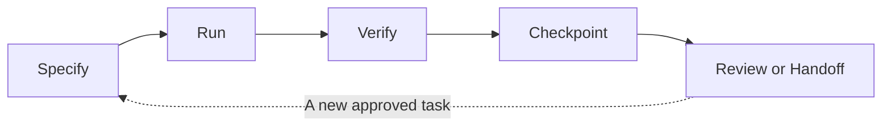

# TauLoop

[中文说明](README.zh-CN.md)

## tau = 2pi

**One complete, evidence-backed turn of work for coding agents.**

TauLoop is not an infinite agent loop. A turn begins with a bounded intent and ends only after execution evidence, verification, a durable checkpoint, and a review or explicit handoff.



## What Completes One Turn?

1. **Specify**: a task spec or run contract states scope, permissions, deadlines, and success criteria.
2. **Run**: TauLoop owns the local child process instead of asking an agent to poll logs.
3. **Verify**: the stage verifier must pass before later work is unlocked.
4. **Checkpoint**: durable facts replace a growing chat transcript.
5. **Review or handoff**: the turn stops for human review or hands a bounded factual package to a fresh context.

The next turn is deliberate. A heartbeat is health evidence, not proof of progress or permission to continue forever.

## What It Provides

- A small `.codex/` harness for memory, plans, task specs, verification, failure learning, and checkpointing.
- The complete continuous-work v2 runtime for bounded serial commands such as Python -> PyTorch -> simulator -> GPU checks.
- Process ownership, low-noise health evidence, deadlines, cancellation, conservative recovery, and verifier-gated progression.
- Fresh-context handoffs that carry facts instead of previous chat history.
- A Python 3.8+ standard-library core for macOS and Ubuntu.

## Boundaries

- TauLoop is a foreground local supervisor, not a daemon that survives a dead terminal or restarted computer.
- It does not promise automatic creation or focus of a visible Codex Desktop window.
- Fixture success does not prove CUDA, a simulator, or a GPU works in your target repository.
- Run-contract permissions are recorded for audit; they are not an operating-system sandbox.

## Install

```bash
git clone https://github.com/TTT-qq-TT/tau-loop.git
cd tau-loop
python3 install.py
```

Ensure `~/.codex/bin` is on your `PATH`, then confirm the user command:

```bash
tau --help
```

Codex discovers the skill at `~/.codex/skills/tau-loop/SKILL.md`. No shell framework or third-party Python package is required.

## Start A Turn

Enable a new project, or safely adopt an existing project:

```bash
tau init --root .
# or: tau adopt --root .
```

For a long serial task, create and review a JSON run contract from `assets/examples/cw-environment-bootstrap.template.md`, then run it:

```bash
tau state init --root .
tau run --root . contract.json
tau run-status --root . <run-id>
```

Use `tau cancel` or `tau recover` for interrupted runs. At a semantic checkpoint, use `tau handoff create`, `tau handoff launch`, and `tau handoff review`.

## Upgrade And Remove

```bash
tau upgrade --root . --dry-run
tau upgrade --root .
tau uninstall --root .
```

Upgrades only change unmodified tool-managed files. Project memory, plans, specs, reports, runtime state, and customized tools are preserved.

## Documentation

- [Project workflow and lifecycle](assets/docs/project-workflow.md)
- [Continuous-work v2 operator guide](assets/docs/continuous-work-v2.md)
- [Continuous-work v1 control-plane reference](assets/docs/continuous-work-v1.md)
- [Environment bootstrap contract](assets/examples/cw-environment-bootstrap.template.md)
- [Security policy](SECURITY.md)

## Development

```bash
python3 -m unittest discover -s tests -v
bash -n bin/tau
python3 -m py_compile install.py assets/tools/*.py
```

See [CONTRIBUTING.md](CONTRIBUTING.md). TauLoop is MIT licensed.
