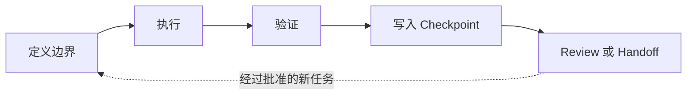

# TauLoop

[English](README.md)

## tau = 2pi

**给 coding agent 的一整圈、可验证的工作。**

TauLoop 不是让 agent 无限循环。一次完整周期从有边界的任务开始，只有在获得执行证据、通过验证、写入 checkpoint，并停在 review 或明确 handoff 后才算结束。



## 什么算完成一圈？

1. **定义边界**：task spec 或 run contract 写清范围、权限、deadline 和成功标准。
2. **执行**：TauLoop 真实拥有本地子进程，而不是让 agent 反复轮询日志。
3. **验证**：verifier 必须通过，后续阶段才会解锁。
4. **写入 checkpoint**：把事实写入文件，不依赖不断增长的聊天上下文。
5. **Review 或 handoff**：停在人工审查点，或将有边界的事实包交给 fresh context。

下一圈必须被明确开启。heartbeat 只代表本地 supervisor 最近看到了受管进程，既不是成功证明，也不是无限继续的许可。

## 它提供什么

- 轻量 `.codex/` harness：memory、plan、task spec、验证、failure learning 和 checkpoint。
- 完整 continuous-work v2 runtime，适合 Python -> PyTorch -> 仿真器 -> GPU 检查等串行任务。
- 真实进程监督、低噪健康证据、deadline、取消、保守恢复，以及 verifier-gated 推进。
- 基于事实而非旧聊天记录的 fresh-context handoff。
- Python 3.8+ 标准库 core，支持 macOS 与 Ubuntu。

## 明确边界

- TauLoop 是前台本地 supervisor，不是 terminal 结束或电脑重启后仍存活的 daemon。
- 它不承诺自动新建或聚焦可见的 Codex Desktop 窗口。
- fixture 成功不等于目标项目中的 CUDA、仿真器或 GPU 已经可用。
- run contract 的 permissions 用于审计，不是操作系统级 sandbox。

## 安装

```bash
git clone https://github.com/TTT-qq-TT/tau-loop.git
cd tau-loop
python3 install.py
```

确保 `~/.codex/bin` 在 `PATH` 中，然后验证：

```bash
tau --help
```

Codex 会从 `~/.codex/skills/tau-loop/SKILL.md` 发现这个 skill。不需要 shell 框架，也不需要第三方 Python 包。

## 开始一圈工作

给新项目启用，或安全接入已有项目：

```bash
tau init --root .
# 或：tau adopt --root .
```

对于长时串行任务，从 `assets/examples/cw-environment-bootstrap.template.md` 创建并审查 JSON run contract，再执行：

```bash
tau state init --root .
tau run --root . contract.json
tau run-status --root . <run-id>
```

中断时使用 `tau cancel` 或 `tau recover`。语义 checkpoint 到达后使用 `tau handoff create`、`tau handoff launch`、`tau handoff review`。

## 升级与移除

```bash
tau upgrade --root . --dry-run
tau upgrade --root .
tau uninstall --root .
```

升级只会改写未被用户修改的工具文件；memory、plan、spec、report、runtime state 和自定义工具都会保留。

## 文档

- [项目工作流与生命周期](assets/docs/project-workflow.md)
- [Continuous-work v2 操作手册](assets/docs/continuous-work-v2.md)
- [Continuous-work v1 控制面说明](assets/docs/continuous-work-v1.md)
- [环境配置 contract 模板](assets/examples/cw-environment-bootstrap.template.md)
- [安全策略](SECURITY.md)

## 开发

```bash
python3 -m unittest discover -s tests -v
bash -n bin/tau
python3 -m py_compile install.py assets/tools/*.py
```

详见 [CONTRIBUTING.md](CONTRIBUTING.md)。TauLoop 使用 MIT 许可证。
